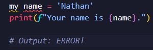

# What is Programming language 
- It is language which helps to communicate with computers{they are not able to understand human languages}
prog lang : helps to write programs using those languages 
## What is program ?
- A program is an **algorithm** expressed in a programming language.
- An algorithm is a detailed sequence of actions to perform to accomplish some task Named after an iranian mathematician,Al-Khwarizmi.
- Technically, an algorithm must reach a result after a finite number of steps.
- With those steps programs Do a Specific task Correctly.
## Evolution of I/O{input/output} 
- Early in the  history of computing,programsb were submitted on **punch cards with all the data** they requird and excuted together with other programs that used the same libraries.Outpit was to a **line printer** .
- Later development  introduced interactive processing which allowed the user to provide data while the program was running this normally takes place  in a Question & Answer format.
## Transistor

## Integreted Circuit

## Micro controller

## Types of Programming languages
- Computers Understand binary (0/1)

## How do high level languages work?
- As we saw earlier we have said that computers know only binarys,and if we code with high level languages how do computers understand us?
1) Compilers:- are tools which helps to convert the whole code to bytecode then computer will execite it 
    

    a) Example :C,C++,Java . . .
2. Interpreter :can directly execute the code by reading the source code line by line 
    

    a) Example :python

A) 
B)
## What is python
- Python is High level & Interpreted programming language => Very easy to learn
    
 ### It is very easy
 
## History of python 
- Python was developed by *Guidovan Rossum*
 in the late 1980 at the Ntional Research Institute for Mathematics and Computer Science in the Netherlands .
 
 - Python is now maintained by a core development team at the
institute, although Guido van Rossum still holds a vital role in
directing it's progress.
## Uses of Python
- Data visualization
- Data analysis
- Machine learning 
- Artificial intellegence 
- Bach-end web developement (with frameworks like Django and Flask)
- Game developement
- Hacking script writing
## IDE & Code editors
- IDE ( Integrated Development Enviroment ): Is a
Software that helps to write & run a Specific Programming
language. Example: PythonIDE
- Code Editors: are softwares those can help to write any
kind of programming languages. And also by adding some
compiling/ interpreting feature they can run
programs/scripts Example: Sublime,Vscode
## Output and Comments 
- On python to display output we use keyword 'print'
- Syntax : print (object = ' ' , sep=' ' , and=' ')
## Comments
- This are a simple notes written on our codes those can help as to remember the function
of the code or to make it simple for peoples to understand our code.
- Comments won’t be executed.
- Syntax: # This is a comment line

## Python keywords
 -Keywords are predefind ,reserved words used in python programming that have special meanings to the complate.
 
## Variables
- Variables are a value holders /containers/
They store data
- We give some value to some word.
- example : number = 10
=> from now on my python program knows the value of
number is 10.
- The process of giving value to word is called Variable Declaration
- The word that holds the data is called Identifier
- We can Print value of variables by giving the identifier

- You can print the variable with {variableName} on
print keyword
- Syntax: print(f”yourtext {variable}”)

## Remember!
On naming the identifier:
   

   a)   Don't use space between words use 
   

   b) Don't use numbers as identifier 
## Data types 
- Have you seen the data types we used on the variable slide?
- There are a lot of Data types on python

## A) Numeric Data type
- int(integer) - holds signed integers of non-limited length.
- float - holds floating decimal points and it's accurate up to 15 decimal places.
- complex - holds complex numbers.
 - You can Identify The type of a variable with the keyword ‘type()’
  
 
## B) String Data

- String is a sequence of characters represented by either single or double quotes. For
example, var = “ ” or var = ‘ ’
## C) Sequence Data
### A)
Lists

i) List is an ordered collection of similar or different types of items separated by
commas and enclosed within brackets [ ]. For example, languages =
["Swift", "Java", "Python"]

ii) To access items from a list, we use the index number (0, 1, 2 ...). For
example, languages[0]

iii) We can add/modifie objects to the list,

### 2) Tuple
- Tuple is an ordered sequence of items same as a list. The only difference is that tuples are
immutable. Tuples once created cannot be modified.
- we use the parentheses () to store items of a tuple. For example, product = ('Xbox', 499.99)
- Similar to lists, we use the index number to access tuple items in Python

### D) Dictionary data

- Python dictionary is an unordered collection of items. It stores elements in key/value
pairs.
  - user1 = {'username':’nathan26,’password’:’p@$$word’}
     - username and password = key

     - nathan26 & p@$$word = value
- We use keys to retrieve the respective value. But not the other way around. For example,
